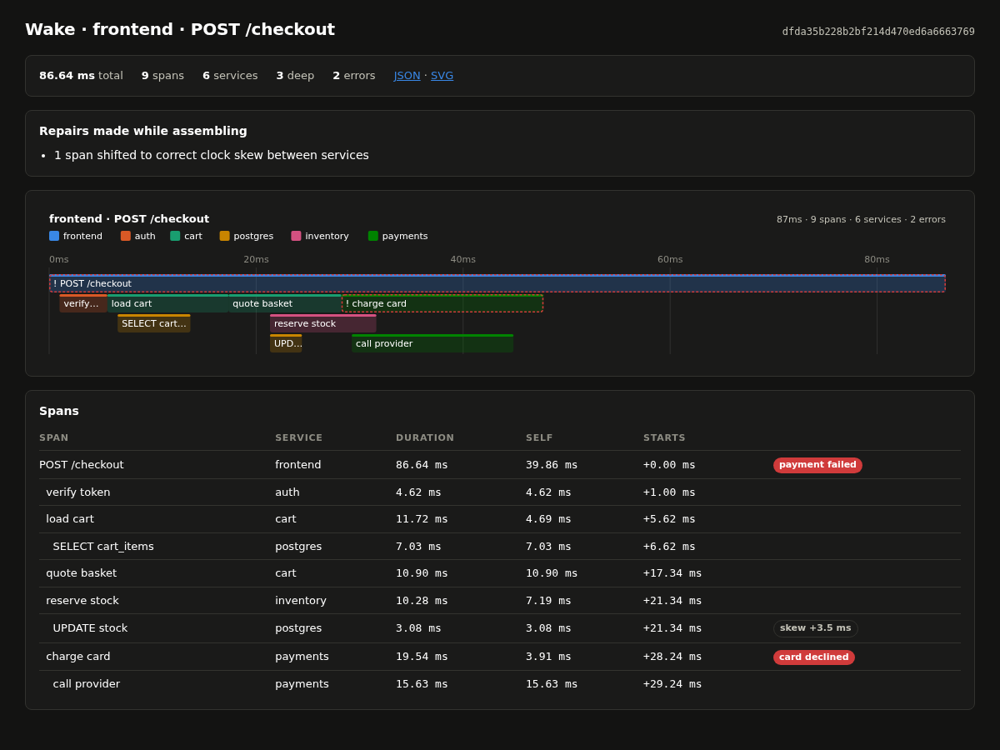
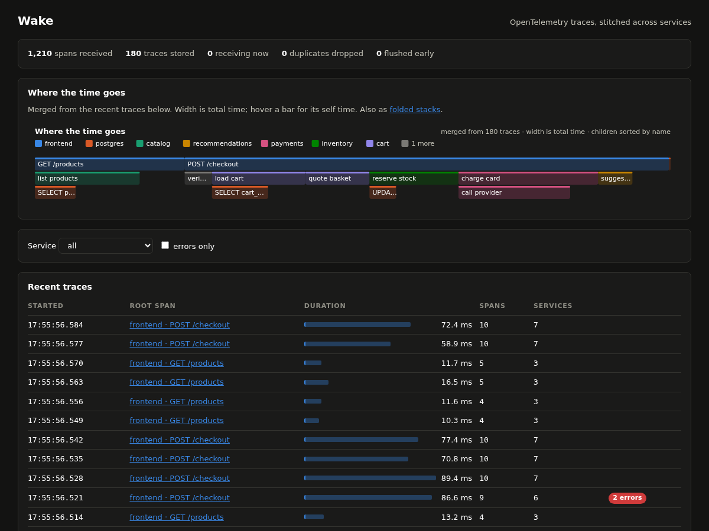

# Wake

An OpenTelemetry trace collector. It accepts spans over OTLP, stitches them into
traces across services, stores them in SQLite, and serves flame charts and flame
graphs. No runtime dependencies.

```bash
wake serve                       # OTLP/HTTP on :4318, pages on the same port
OTEL_EXPORTER_OTLP_ENDPOINT=http://127.0.0.1:4318 your-instrumented-service
```

A ship's wake is the trail it leaves behind. A trace is the trail a request
leaves through a system.



---

## It reads what real exporters send

The test suite runs the official OpenTelemetry SDK and its HTTP exporter against
a live Wake. Two services share one distributed trace, with context carried from
one to the other, and the test asserts they come back stitched into a single
tree. That test is the compatibility claim.

OTLP arrives in two encodings, and Wake reads both.

**Protobuf**, which every official exporter sends by default, is decoded by a
hand-written reader of the wire format: varints, fixed-width fields,
length-delimited nesting, unknown fields skipped for forward compatibility. Its
field numbers are checked in the tests against the descriptors in the official
generated code, so a renumbering upstream fails a test instead of silently
misreading spans.

**JSON**, where OTLP departs from the standard protobuf mapping by writing ids
as hex and enums as integers. Testing against JSON produced by the official
protobuf library found that it does neither, so base64 ids and enum names such as
`SPAN_KIND_CLIENT` are accepted as well.

---

## Measured

Intel Core i5-11320H, 8 threads, Linux 6.8, Python 3.12.13, laptop SSD.
200,000 spans of synthetic shop traffic in batches of 512. Reproduce with
`make bench`.

### Sustained throughput is the storage rate

| Protobuf decoder | Accepted over HTTP | **Stored on disk, sustained** |
|---|---:|---:|
| Official library, when installed | 59,911 spans/s | **14,646 spans/s** |
| Hand-written, no dependencies | 34,881 spans/s | **12,516 spans/s** |

The server ran on two cores and four sender threads on four others. All 31,464
traces were stored, with no errors and none flushed early.

The right-hand column is the one that matters. A collector that accepts spans
faster than it can store them only fills its buffer until the budget forces
traces out early. So "stored" is timed from the first request until the last
trace is on disk, and accepting alone is reported separately rather than quoted
as capacity.

The two columns differ because decoding and storage share one Python
interpreter. Storage alone, measured in isolation, reaches 31,795 spans a second.
Under load it competes with the request handlers for the same lock.

### Hand-written protobuf is the slowest decoder

| Decoder | Spans/s |
|---|---:|
| Official library, parsing only | 4,286,249 |
| Official library, parsing plus building spans | 122,267 |
| JSON, standard library | 80,637 |
| **Protobuf, hand-written** | **47,931** |

Protobuf is 3.6 times smaller on the wire, 93 bytes a span against 335 for
JSON. In pure Python it is still slower to decode than JSON, because Python's
JSON parser is written in C and this protobuf reader steps through bytes in
Python.

The official library's C parser takes parsing off the table entirely. What is
left is building Python objects, which is why it is only about three times
faster end to end rather than a hundred.

So the dependency-free reader stays as the fallback, and the library is used
automatically whenever it is installed. `pip install wake-traces[fast]` enables
it and `WAKE_PURE_PROTOBUF=1` forces the fallback. A test decodes real SDK output
and demo traffic both ways and requires identical spans, and CI runs the entire
suite under each.

### Storage, one profile at a time

The first working version flushed about 1,900 traces a second while ingest
accepted 34,000 spans a second. Storage, not HTTP, was the ceiling. Each change
below was made because a profile pointed at it, then measured, on 20,000 traces.

| Change | In memory | On disk |
|---|---:|---:|
| A transaction and a row per span, per trace | 1,941 traces/s | not measured |
| One transaction per batch; no read-back for new traces | 3,725 | 2,000 |
| One row per trace, spans as a blob in the last column | 4,765 | 2,901 |
| Compact positional span rows; summaries skip self time | **7,485** | **5,000** |

What each profile showed:

- **Reading back.** Every save read the trace's spans back to rebuild its
  summary, even for a trace that had never been stored. That was 28% of every
  flush. Now only a late span merging into a stored trace triggers a read.
- **Commits.** On disk, commits took 139 ms each, 35% of the run. The cause was
  a row per span keyed on random ids, so each commit dirtied pages across the
  B-tree. One row per trace cut commit time fivefold.
- **Summaries.** Assembling a full tree for each stored summary took 43% of what
  was left, including self-time arithmetic the summary never uses.
- **Size.** The stored span repeated the trace id and carried computed display
  fields. The compact form halved the database from 72.7 MB to 34.9 MB.

### Memory

| Span class | Bytes per span | Bytes per trace |
|---|---:|---:|
| With `__slots__` | 707 | 4,499 |
| Without | 747 | 4,754 |

The default buffer budget of 200,000 spans costs about 141 MB.

Slots save 40 bytes, about 5%. That is far less than the usual claim, and an
earlier comment in this code repeated that claim until the measurement corrected
it. Python 3.12 already stores plain instance attributes compactly. What a span
really costs is its id strings and its attribute dictionary.

---

## Stitching

Spans from different services arrive separately, in any order, sometimes twice,
and sometimes with their parent missing. The assembler builds one tree from
whatever arrived and records every repair it made, and the trace page lists them.

**Duplicates.** Exporters retry whole batches. The first copy of a span wins, and
later copies are counted rather than stacked.

**Orphans.** A span whose parent never arrived is kept, shown at the top level,
and marked. Dropping it would hide exactly the spans from the service whose
exporter is misbehaving. A parent chain that loops back on itself is broken
rather than followed forever.

**Clock skew.** Each service stamps times with its own clock. When a child from a
different service seems to start before its parent, the parent's clock is taken
as the reference and the child's whole subtree shifts to begin no earlier.
Durations never change. A child starting early within the same service is left
alone, because one clock cannot disagree with itself, so that is a real bug worth
seeing.

**Self time.** A span's own time is its duration minus the time its children
cover. Parallel children overlap, and subtracting their summed durations would
give negative self time. So the covered time is the union of the children's
intervals, clipped to the parent.

**Depth.** A trace nesting deeper than Python's recursion limit still assembles,
because the walk is iterative. There is a test with 5,000 levels.

---

## Two pictures, named correctly

A **flame chart** is one trace on a real time axis. Position is when a span ran,
width is how long, and depth is who called whom. Calls made in parallel get their
own lanes. They once shared a row and one bar hid the other, which only a look at
the rendered chart revealed. There is a test for that now.

A **flame graph** merges many traces. Identical call paths collapse into one bar
whose width is total time, with children sorted by name rather than time, in the
format Brendan Gregg introduced. Wake also serves it as folded stacks, the text
his tools read.



Both are SVG with no script. Every bar has a native tooltip with duration, self
time, offset, errors and any repair applied. Each service takes a fixed colour
slot from a palette checked for colour-vision separation, in order of first
appearance. Past seven services the rest fold into grey rather than introducing
hues nobody can tell apart.

The palette's red slot is deliberately unused, because it sits too close to the
error colour. Errors carry a dashed outline and a label, so colour is never the
only signal.

---

## Buffering and storage

Nothing marks the last span of a request, so a trace counts as finished once it
has gone quiet. The buffer holds traces still receiving spans, ordered by when
each last changed.

A trace with no new span for `--idle` seconds is flushed to SQLite. So is the
least recently touched trace whenever the buffer passes its span budget, which
keeps memory bounded when traffic outruns the idle timeout. Those early flushes
are counted and flagged in the listing, because they are the traces most likely
to be missing a late span.

A span that arrives after its trace was stored is not lost. It merges into the
stored trace on the next flush, and the summary is recomputed.

---

## Endpoints

| Route | What it is |
|---|---|
| `POST /v1/traces` | OTLP/HTTP ingest, protobuf or JSON, gzip accepted |
| `GET /` | recent traces, merged flame graph, service and error filters |
| `GET /traces/{id}` | one trace: repairs, flame chart, span table |
| `GET /traces/{id}/flame.svg` | the flame chart alone |
| `GET /flame.svg`, `GET /flame.folded` | merged flame graph, as SVG or folded stacks |
| `GET /api/traces?service=&min_ms=&errors=1` | search |
| `GET /api/traces/{id}` | the assembled tree as JSON |
| `GET /api/stats` | counters, buffer state, and which protobuf decoder is in use |

Malformed bodies get a 400 that says what was wrong. An unsupported content type
gets a 415 that names the right ones. A body over 16 MB gets a 413 before it is
read.

## Tests

| Area | Tests |
|---|---:|
| OTLP decoding against the official SDK, both decoders, both encodings | 26 |
| Protobuf wire format | 20 |
| Stitching and repairs | 19 |
| Buffer and storage | 17 |
| Flame charts, flame graphs, folded stacks | 16 |
| HTTP, including the real exporter end to end | 10 |

```
$ .venv/bin/python -m pytest -q
108 passed in 6.3s
```

## Running it

```bash
make install     # includes the OpenTelemetry SDK, for tests only
make test
make serve       # then, in another terminal:
make demo        # a shop with seven services, parallel calls, errors, skew and orphans
```

## Not built

- **gRPC.** OTLP/HTTP only. gRPC needs HTTP/2 framing and a dependency.
- **Storage in its own process.** The sustained benchmark says this is the next
  ceiling. Decoding and storage share one interpreter, which is why accepted and
  stored throughput differ by four times.
- **Tail sampling.** Every trace is kept until the database is cleaned out by
  hand.
- **Retention.** There is no automatic expiry.
- **Metrics and logs.** Traces only.
- **Authentication.** Bind to localhost, or put a proxy in front.

## Layout

```
wake/
  protowire.py  the protobuf wire format, read by hand
  otlp.py       OTLP protobuf and JSON to spans; picks the decoder
  otlp_fast.py  the same through the official library, when installed
  encode.py     spans to OTLP protobuf, for the demo and benchmarks
  model.py      the span, its API form and its compact stored form
  assemble.py   stitching, orphans, clock skew, self time
  store.py      the buffer, SQLite, and the collector over both
  flame.py      flame charts, flame graphs, folded stacks
  pages.py      the server-rendered pages
  server.py     OTLP ingest, the API, the background flusher
  demo.py       synthetic multi-service traffic
  cli.py        serve, demo, flame
bench/
  ingest.py     decode, buffer, flush, HTTP accepted and stored
  memory.py     bytes per buffered span, with and without slots
tests/          108 tests
```
